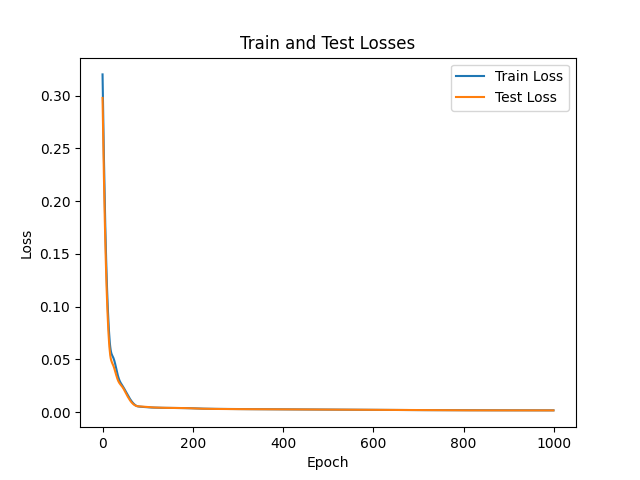
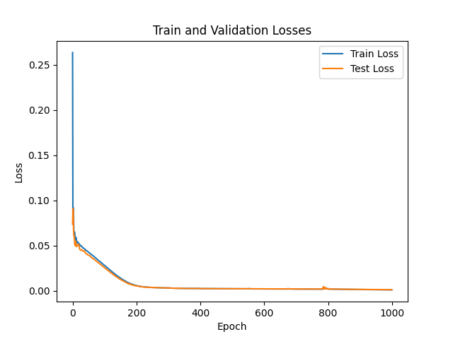
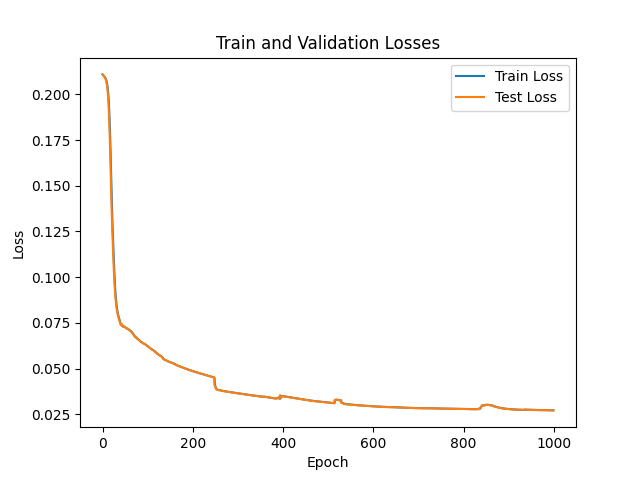
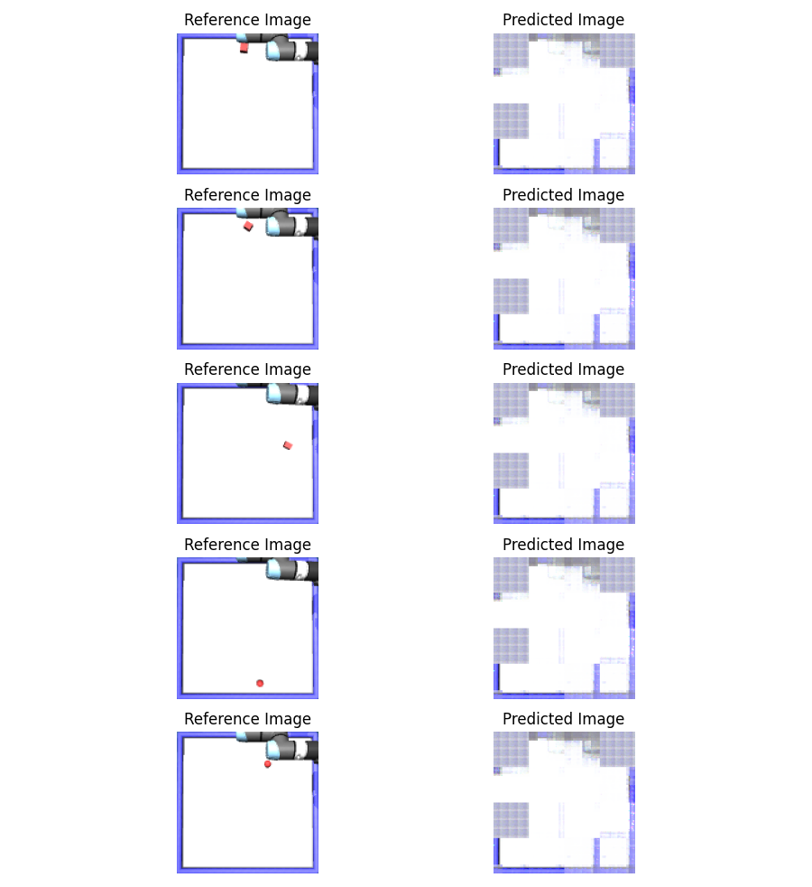

# CMPE591 Homework 1

## Train and Validation Losses over Epochs

Each model is trained over a dataset with 1000 simulations over 1000 epochs. Trained models and respective datasets are included.

### Part 1:
In this part, the input is 4x1 actions + 1x1 object type. Reference output is 2x1 final object position. MSE loss over epochs can be seen in figure below.

### Part 2:
In this part, the input is 4x1 actions + 128x128 initial image. Reference output is 2x1 final object position. MSE loss over epochs can be seen in figure below.

### Part 3:
In this part, the input is 4x1 actions + 128x128x3 initial image. Reference output is 128x128x3 final image. MSE loss over epochs can be seen in figure below.

Output image of the model can be seen in the figure below. It look unsatisfactory.

